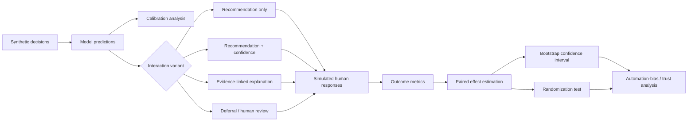

# Responsible AI Interaction Lab

A small experimental framework for studying how **confidence, explanations and human review design** change the way people interact with AI recommendations.

This repository focuses on an easily overlooked problem:

> A model can be technically accurate while the surrounding interface still encourages bad decisions.

The lab therefore treats interaction design as part of model risk.

## Questions explored

- Does showing a numeric confidence score make reviewers over-trust the model?
- Do evidence-linked explanations improve review quality compared with generic rationales?
- When should a system defer instead of presenting a strong recommendation?
- How often do reviewers override the AI, and are overrides concentrated in low-confidence cases?
- Does an explanation increase agreement even when the recommendation is wrong?
- How does calibration affect a policy threshold for automation?

## Experiment architecture



## Core metrics

- model accuracy;
- expected calibration error (ECE);
- Brier score;
- human accuracy;
- AI-human agreement rate;
- override rate;
- **harmful agreement rate** — human agrees when AI is wrong;
- beneficial override rate — human corrects an AI error;
- harmful override rate — human changes a correct AI answer into a wrong one;
- deferral rate;
- accuracy after deferral;
- explanation-induced agreement delta.

## Paired experiment design

The original aggregate comparison ran baseline and treatment with unrelated random
reviewer draws. That can make ordinary simulation noise look like an interface effect.
The paired evaluator instead derives a stable random stream from each case ID and
experiment seed, then evaluates both variants against the same latent reviewer draw.

For human accuracy, harmful agreement and beneficial override, the report includes:

- baseline and treatment means;
- the paired absolute effect;
- a percentile bootstrap confidence interval;
- a two-sided paired sign-flip randomization p-value;
- the number of matched cases.

Case-level seeds do not depend on input order or Python's randomized string hash.
Duplicate case IDs are rejected because they would violate the matched-unit contract.
These statistics quantify uncertainty in the synthetic experiment only; they are not
presented as findings about real reviewers.

## Interaction variants

### Recommendation only

The reviewer sees only the proposed action.

### Confidence

The reviewer sees the action and a confidence estimate. This may improve uncertainty awareness, but it can also create anchoring.

### Evidence-linked explanation

The reviewer sees the recommendation plus the evidence IDs and reason codes that support it.

### Deferral

If model confidence or policy conditions fail a threshold, the interface does not present a strong automated recommendation and routes the case for human judgment.

## Repository layout

```text
responsible-ai-interaction-lab/
├── experiment.py       # calibration, interaction simulation and aggregate metrics
├── evaluation.py       # matched responses, effect estimates, bootstrap and tests
├── app/api.py          # calibration, interaction and paired-comparison HTTP API
├── tests/              # deterministic metric, pairing, API and edge-case coverage
└── README.md
```

## Run

```bash
python experiment.py
```

The API also exposes `POST /synthetic/paired-compare` for a reproducible matched
baseline/treatment report with uncertainty estimates.

The demo produces synthetic probabilities and reviewer responses only. It is intended to demonstrate evaluation methodology, not to claim human-subject research results.

## Portfolio signal

**Responsible AI · Human Factors · Calibration · Human-in-the-loop · Automation Bias · Explainability · Experiment Design · AI Product Evaluation**

## Subgroup interaction-harm audit

Aggregate accuracy can hide an interface that works well overall while increasing harmful
agreement for one population slice. `audit_interaction_slices` joins simulated or observed
responses to explicit case-to-group labels and reports, per eligible group:

- human accuracy;
- harmful agreement with an incorrect AI recommendation;
- beneficial correction of an AI error;
- deferral rate.

The report identifies the worst harmful-agreement slice and computes max-minus-min gaps for
harmful agreement and human accuracy. Duplicate case IDs, missing or empty labels, and invalid
minimum-size policies fail closed. Groups below the configured minimum are excluded from
comparisons but their case count remains visible, preventing silent disappearance.

These descriptive gaps do not establish discrimination, causality, or statistical significance.
The group definitions, minimum sample size, uncertainty method, intersectional coverage and
real-world data collection protocol require domain and ethics review before deployment decisions.
