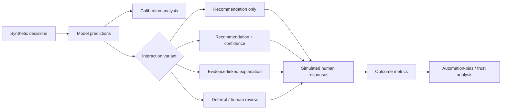

# Responsible AI Interaction Lab

A small experimental framework for studying how **confidence, explanations and human review design** change the way people interact with AI recommendations.

This repository focuses on an easily overlooked problem:

> A model can be technically accurate while the surrounding interface still encourages bad decisions.

The lab therefore treats interaction design as part of model risk.

## Questions explored

- Does showing a numeric confidence score make reviewers over-trust the model?
- Do evidence-linked explanations improve review quality compared with generic rationales?
- When should a system defer instead of presenting a strong recommendation?
- How often do reviewers override the AI, and are overrides concentrated in low-confidence cases?
- Does an explanation increase agreement even when the recommendation is wrong?
- How does calibration affect a policy threshold for automation?

## Experiment architecture



## Core metrics

- model accuracy;
- expected calibration error (ECE);
- Brier score;
- human accuracy;
- AI-human agreement rate;
- override rate;
- **harmful agreement rate** — human agrees when AI is wrong;
- beneficial override rate — human corrects an AI error;
- harmful override rate — human changes a correct AI answer into a wrong one;
- deferral rate;
- accuracy after deferral;
- explanation-induced agreement delta.

## Interaction variants

### Recommendation only

The reviewer sees only the proposed action.

### Confidence

The reviewer sees the action and a confidence estimate. This may improve uncertainty awareness, but it can also create anchoring.

### Evidence-linked explanation

The reviewer sees the recommendation plus the evidence IDs and reason codes that support it.

### Deferral

If model confidence or policy conditions fail a threshold, the interface does not present a strong automated recommendation and routes the case for human judgment.

## Repository layout

```text
responsible-ai-interaction-lab/
├── experiment.py   # calibration, interaction simulation and metrics
└── README.md
```

## Run

```bash
python experiment.py
```

The demo produces synthetic probabilities and reviewer responses only. It is intended to demonstrate evaluation methodology, not to claim human-subject research results.

## Portfolio signal

**Responsible AI · Human Factors · Calibration · Human-in-the-loop · Automation Bias · Explainability · Experiment Design · AI Product Evaluation**
